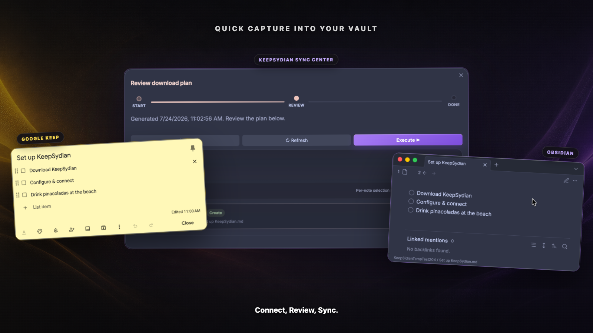

# KeepSydian

**Connect Obsidian to Google Keep & sync on demand or set and forget.**

If, like me, you use Google Keep alongside Obsidian, this plugin is for you. Obsidian's one-time Google Takeout import
gets tedious for anything more than a once-off migration.

Google Keep is great for getting an idea down fast, especially on the go.

When you want that note incorporated into your knowledge workflow, KeepSydian copies it into Obsidian and keeps the two
versions connected. For manual syncing, KeepSydian provides a review center, so you can see and approve any changes
before the plugin writes to your vault. Or, you can set it and forget it, and let KeepSydian run in the background.

[Install KeepSydian](https://obsidian.md/plugins?id=keepsidian) |
[Unlock supporter features](https://keepsidianserver-v2-162887264002.us-central1.run.app/subscribe) |
[See how it works](#how-it-works)

## Move quick captures into Obsidian

I built KeepSydian because I use Keep for quick capture and Obsidian for everything else.

KeepSydian manages the handoff seamlessly. With a few clicks, you can:

- Download Google Keep notes into a folder you choose, text, images and all, while preserving checklists and
  tags.
- Review and approve the exact creates, updates, conflicts, and skips before you commit.
- Keep attachments in a local `media/` directory and optionally display imported images in your notes.
- Run download syncs in the background every 24 hours (or at shorter intervals if you're a supporter).
- Track each sync in a dated activity log inside your vault.

A Google Takeout import is great for that one-time migration, but if both sides keep changing, KeepSydian can help you
stay in sync.

## How it works

1. Capture a note in Google Keep.
2. Open **Sync now** in Obsidian. KeepSydian builds a plan and shows proposed changes.
3. Review the plan, choose **Execute**, and continue working in Obsidian.

Supporters can also upload eligible notes to Google Keep or run an experimental two-way sync. Two-way sync runs a
separate download review followed by an upload from the updated local vault.

## Free and supporter features

Downloads and 24-hour background syncing are free. Supporters can access features that cost more to run or need more
hands-on support.

|Feature|Free|Supporter|
|---|:---:|:---:|
|Download active Google Keep notes & attachments|Yes|Yes|
|Review manual changes before execution|Yes|Yes|
|Background download sync every 24 hours|Yes|Yes|
|Custom background sync interval||Yes|
|Choose individual notes from a review plan||Yes|
|Filters for text, color, pinned, and archived notes||Yes|
|Smart titles and auto-tags||Yes|
|Upload and two-way sync, currently experimental||Yes|
|Two-way background sync||Yes|
|Priority support and early access||Yes|

[Support KeepSydian monthly or annually](https://keepsidianserver-v2-162887264002.us-central1.run.app/subscribe).
Active supporters can manage billing from **Settings > KeepSydian > Exclusive features for project supporters**.

## Install and sync

### 1. Install the plugin

Install KeepSydian from the [Obsidian community plugin store](https://obsidian.md/plugins?id=keepsidian).

You can also:

- Install through [BRAT](https://github.com/TfTHacker/obsidian42-brat).
- Clone this repository into `{vault}/.obsidian/plugins/keepsidian`.

After installation, enable KeepSydian under **Settings > Community plugins**, then open its settings.

### 2. Retrieve your Google Keep token

On desktop, choose **Retrieve token with helper**. KeepSydian asks before downloading the open-source token helper from
GitHub Releases, then reuses the installed helper until an update is needed. If you prefer, you can follow the manual
[Keep-It-Markdown](https://github.com/djsudduth/keep-it-markdown) instructions and paste the token yourself.

On mobile, the retrieval helper is not available. Retrieve a token on desktop and transfer it to your phone using a
method you trust. You can also paste a short-lived `oauth2_4...` token and let the KeepSydian server exchange it.

### 3. Choose where your notes are saved

Choose a save location in the settings. New installs default to `/KeepSydian`. You can customize the
folder and filename patterns with values such as `{title}`, `{now.year}`, `{now.month}`, and `{note.date}`.

Then run **Sync now** from the command palette, ribbon, or status bar.

## The sync review center

The Sync Center shows planned changes for your approval.

- **Sync now** opens the Sync Center and immediately builds a download plan.
- **Open sync center** lets you choose Download, Upload, or Two-way sync first.
- Download plans can start from the last successful sync, all dates, or a custom date.
- The review groups changes by status and action, with the exact affected notes shown below.
- During execution, the review screen, notices, and status bar show sync progress.

(Deprecated) There are legacy `download`, `upload`, and `two-way` commands, which are a hold-over from older versions.
They open the same sync center flow, and will be removed in future versions.

## Privacy and data handling

Your Google Keep token is stored on your device. When your Obsidian version supports Secret Storage, KeepSydian uses it.

KeepSydian sends your email, token, and the note data needed for the requested sync to its server. The server uses
[Keep-It-Markdown](https://github.com/djsudduth/keep-it-markdown) to connect to Google Keep, discards the credentials
after the request, and does not log or store your credentials or notes.

This server lets you use KeepSydian without installing and maintaining a local Python environment.

## Sync details

### Conflicts

If both copies changed since the last sync, KeepSydian tries to merge their bodies while preserving the existing
frontmatter. If the merge cannot be completed safely, the incoming note is saved as a separate
`-conflict-<timestamp>.md` file.

### Attachments

- Downloaded attachments are stored in the sync folder's `media/` directory.
- The **Display imported images in notes** option in plugin settings adds Obsidian image embeds while keeping the files
  in `media/`.
- Upload scans notes under the configured save location for attachments referenced from `media/`.
- Missing files are skipped and recorded in the sync log.
- Media uploads are not supported by the experimental two-way workflow.

### Frontmatter

KeepSydian adds these frontmatter fields to match each Markdown file with its Google Keep note:

- `GoogleKeepUrl`
- `GoogleKeepCreatedDate`
- `GoogleKeepUpdatedDate`
- `KeepSydianLastSyncedDate`

## Mobile

KeepSydian works on Obsidian mobile. Once the token is in place, you can capture notes in Google Keep from a phone or
watch, then download them into your Obsidian vault from your phone.

The desktop token helper is the only part of setup that is not available on mobile.

## Frequently asked questions

### Why not use Google Takeout?

Takeout is a good fit for a one-time migration. KeepSydian adds repeat downloads, incremental sync dates, reviewable
plans, conflict handling, and supporter uploads back to Google Keep.

### Is two-way sync safe?

Two-way sync is experimental and available to supporters. It is disabled until you acknowledge the backup advisory
and opt in. Back up your vault before enabling it.

### Does KeepSydian replace Obsidian Sync?

No. Obsidian Sync moves your vault between devices. KeepSydian connects a chosen folder in that vault with Google Keep.

### Why did KeepSidian become KeepSydian?

Obsidian's plugin naming guidelines no longer allow new plugin names ending in `-sidian`. The spelling changed so the
plugin could remain in the official directory. Only the spelling changed.

## Help shape KeepSydian

Found a bug or have an idea? [Open an issue](https://github.com/lc0rp/KeepSydian/issues).

You can also vote on the [KeepSydian wishlist](https://umh39lhux3j.typeform.com/to/NKbRukRg).

## License

[MIT](LICENSE)
